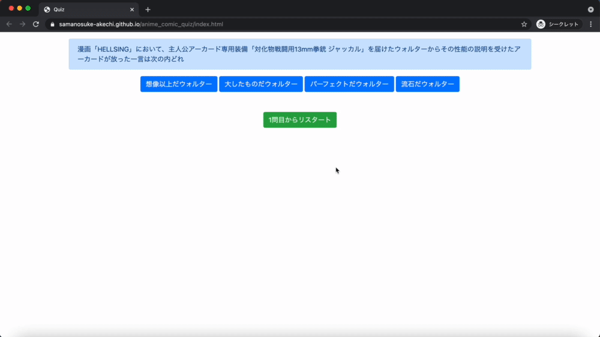
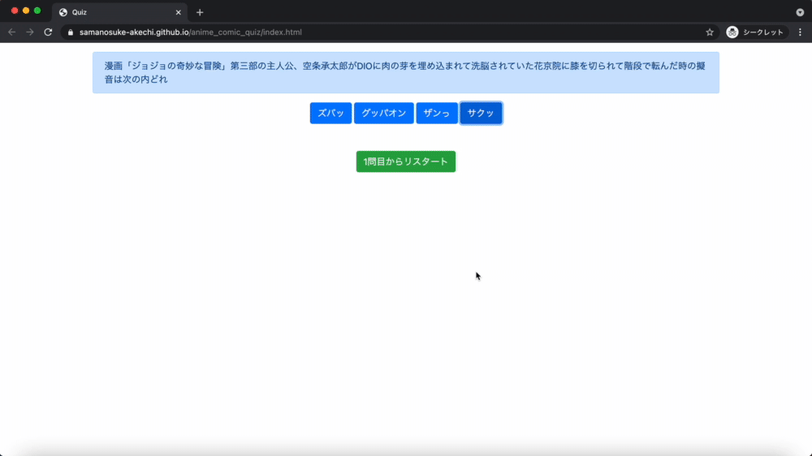

# クイズゲーム

## アプリケーションのURL
https://samanosuke-akechi.github.io/anime_comic_quiz/index.html  
 
## 利用方法
選択式のクイズゲームです。出題される問題に対して選択肢が出るので、正解と思うものをクリックしてください。  
選択肢をクリックするとポップアップが出てきて、正解または不正解のメッセージが出てきます。出てきたメッセージは「OK」をクリックまたはescキーで閉じて、次の問題が出てきます。  
全問解答したら最後に正解数に応じたスコアが出てきます（1問1点）。
全問解答してスコアのポップアップを閉じると、また1問目のクイズに戻ります。  
クイズの途中で「1問目からリスタート」をクリックすると1問目から回答をやり直すことが出来ます。その場合、スコアはリセットされます。  
 
## 要件定義
### クイズ出題
クイズの出題を行います。回答が行われる度に問題文がJavaScriptによって書き変わるようになっています。  
最後の問題を解答したら1問目の問題文に書き変わります。

### 選択肢表示
クイズの選択肢の表示を行います。button要素に対してJavaScriptで問題文に対する選択肢を表示させています。回答が行われた後に選択肢も書き変わります。  
最後の問題を解答したら1問目の問題文に書き変わります。

### 正誤判定
選んだ選択肢が正解かどうかを判定して条件分岐で、「正解」または「不正解」のメッセージを表示したポップアップが出てきます。

### スコア機能
クイズの正解数に応じたスコアが出ます（1問1点）。加点方式でスコアを出しています。

### リセット機能
クイズを途中でリセットして、1問目からやり直すことが出来ます。問題文と選択肢は1問目のものに切り替わり、スコアもリセットされます。  
 
## DEMO
一番上にクイズの問題文、その一段下に選択肢が表示されます。一番下にある緑色のボタンがリセットボタンです。  
選択肢の一つをクリックすると「正解！」または「不正解！」のポップアップが表示されます。  
  
 
クイズを全問解答したら、最後にスコアがポップアップ表示されます。
  
 
## 使用技術（開発環境）
## フロントエンド
HTML, JavaScript  

## フレームワーク
Bootstrap

## 本番環境
GitHub Pages

## ソース管理
GitHub, GitHub Desktop

## エディタ
Visual Studio Code  